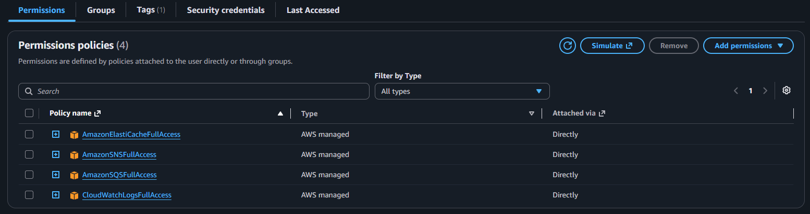
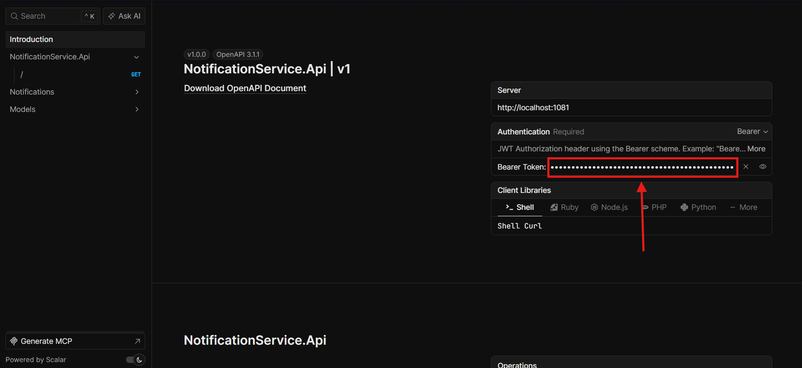

# Event Platform MVP

El MVP realizado diseñado con una implementación hibrída en mente, utilizando tanto servicios en la nube de AWS como servicios on-premise sin embargo ya que esta realizado utlizando contenedores la migración a un entorno de ejecución totalmente en la nube se puede lograr sin demasiadas complicaciones.

Los servicios desarrollados en .net son los siguientes:

- **EventService** — API RESTful para crear eventos con zonas (transacción atómica), listar eventos con visibilidad basada en roles servidos desde una caché Redis rápida y recuperar detalles del evento. Al crearse, publica de forma fiable un evento `EventCreated` en AWS SNS.

- **NotificationService** — Consume `EventCreated` de una cola AWS SQS suscrita,mantiene un registro de notificación persistente y envía un único correo electrónico de texto simple al administrador a través de MailKit (MailHog en desarrollo). Los fallos de SMTP se registran y se reintentan una cantidad determinada de veces antes de pasar el evento a una DLQ.

## Estructura Proyecto

```text
services/
├── event-service/          # CRUD eventos + publicació EventCreated
│   └── src/
│       ├── EventService.Domain/          # Entidades, reglas
│       ├── EventService.Application/     # MediatR handlers, validators, DTOs
│       ├── EventService.Infrastructure/  # EF Core, Redis, SNS publish
│       └── EventService.Api/             # REST endpoints, Scalar
├── notification-service/   # Consume EventCreated → record + email
│   └── src/
│       ├── NotificationService.Domain/   # Entidades
│       ├── NotificationService.Application/
│       ├── NotificationService.Infrastructure/  # EF Core, SQS consumer, MailKit
│       └── NotificationService.Api/      # Health, notifications query, Scalar
└── common/              # Shared event contracts (EventPlatform.Contracts)
```

## PreRequisitos

Para el entorno de desarrollo se necesita el siguiente software:

- Visual Studio 2026
- .NET 10 SDK
- Docker

Adicionalmente se necesita tener una cuenta AWS para poder utilizar los servicios correspondientes, en este caso para simplificar el desarrollo se opto por un usuario IAM con las politicas de permisos tal como se muestra en la siguiente imagen:



> [!WARNING]
> Si bien para entornos productivos existen mejores formas de gestionar permisos se decidio asignar permisos generales sobre los servicios requeridos para mantener la simplicidad de las configuraciones y debido al poco tiempo con el que se contaba.

## Ejecutar el proyecto

Para ejecutar el proyecto se debera seguir los siguientes pasos:

1. Desde la consola navegar hasta la carpeta src/ y ejecutar los siguientes comandos:

```powershell
# copiar el archivo .env de ejemplo
Copy-Item .env.example .env

# completar las variables del archivo .env recien creado y luego ejecutar el siguiente comando
docker compose up -d --build
```

> ### **Nota** :
>
> Dentro de lo posible se trato de poner valores por defecto a la mayoria de varaible de entorno para facilitar al usuario el levantar el proyecto y no sea necesario configurar todas, sin embargo, las variables AWS_ACCESS_KEY_ID,AWS_SECRET_ACCESS_KEY y AWS_REGION son de caracter obligatorio y deberan con valores reales.

Una vez ejecutado los comandos antes indicados se crearan los siguientes servicios

| Servicio                  | Puerto(s)   | Descripción                                                                                                                                                                                     |
| ------------------------- | ----------- | ----------------------------------------------------------------------------------------------------------------------------------------------------------------------------------------------- |
| `postgres-events`         | 5432        | Base de datos del api eventos                                                                                                                                                                   |
| `postgres-notifications`  | 5433        | Base de datos del api notificaciones                                                                                                                                                            |
| `redis`                   | 6379        | ElastiCache-compatible cache                                                                                                                                                                    |
| `mailhog`                 | 8025 / 1025 | Servicio SMTP para notificación mediante correos, para consultar los correos de notificación ingresar al siguiente [link](http://localhost:1080)                                                |
| `keycloak`                | 8080        | OIDC IdP, [Dashboard Administracion](http://localhost:8080)                                                                                                                                     |
| `eventservice.api`        | 8080        | Api RESTful de servicio de eventos, para facilitar el proceso de pruebas se habilito Scalar UI al cual se puede acceder desde el siguiente enlace [link](http://localhost:1080/scalar)          |
| `notificationservice.api` | 8080        | Api RESTful de servicio de notificaciones, , para facilitar el proceso de pruebas se habilito Scalar UI al cual se puede acceder desde el siguiente enlace [link](http://localhost:1081/scalar) |

2. A continuación ingresar al "Dashboard Administración" de keycloack para validar que el servicio esta ejecutando correctamente utilizando las siguiente credenciales:

<table>
<tr>
<td>Usuario</td>
<td>admin</td>
</tr>
<tr>
<td>Password</td>
<td>admin</td>
</tr>
</table>


3. Una vez validado que el servicio de keycloack esta ejecutando correctamente ejecutar los siguiente comandos de acuerdo a para obtener el token del usuario con el cual podremos utilizar los servicio api.

Para Windows:

```powershell
Invoke-RestMethod -Uri "http://localhost:8080/realms/master/protocol/openid-connect/token" `
  -Method Post `
  -ContentType "application/x-www-form-urlencoded" `
  -Body @{
    grant_type = "password"
    client_id  = "event-platform"
    username   = "admin"
    password   = "admin"
  } | ConvertTo-Json -Depth 10
```

Para Linux/Unix:

```bash
curl -X POST http://localhost:8080/realms/master/protocol/openid-connect/token \
  -d "grant_type=password" \
  -d "client_id=event-platform" \
  -d "username=admin" \
  -d "password=admin"
```

Una vez ejecutado el comando debemos recuperar el valor del campo "access_token" del json que se nos muestra en pantalla, con el podremos ir la interfaz de ScalarUI de cualquiera de los api desarrollados y en la sección "Introduction" configurar el valor correspondiente al Bearer Token tal como se muestra en la imagen, para utilizarlo posteriormente en las peticiones que realicemos a los distintos apis del proyecto.



Cabe recordar que la configuración del bearer token de manera individual por cada servicio en la interfaz de Scalar, en caso se utilicen otras herramientas como Postman o directamente desde la consola el Bearer se debera enviar mediante el Header Authorization en la petición.

> ### **Nota** :
>
> En este caso se ha omitido los pasos para la migración y carga de datos iniciales debido a que se realizo el desarrollo de tal manera que tanto las migraciones como la carga de datos se realiza de manera automática al crear el contenedor y siempre validando que solo se ejecuten una vez, este mecanismo no esta pensado para cargar diferentes scripts de carga inicial aunque modificar el proyecto para lograrlo no deberia ser complicado.


